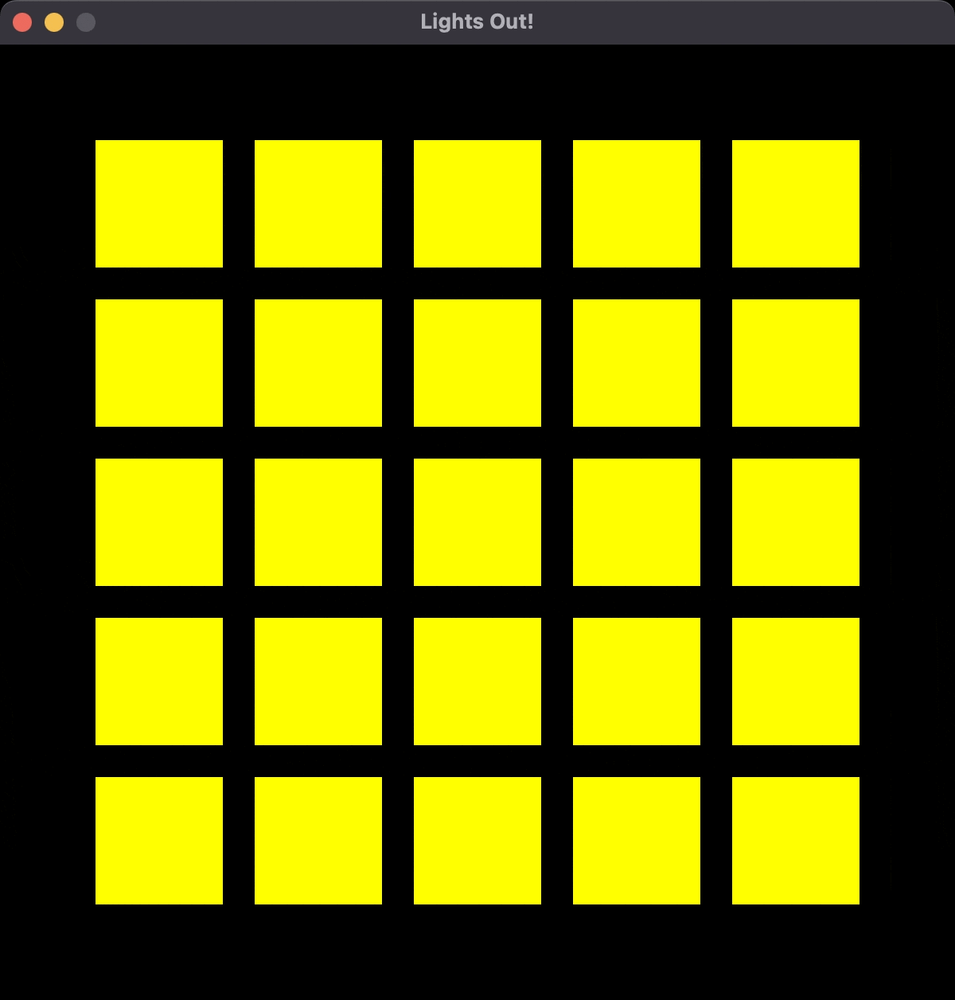
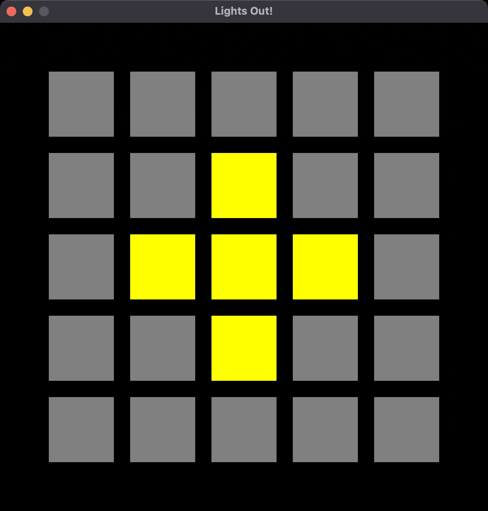

# Lights Out

## The Game
LightsOut is based on a deceptively simple concept. Clicking on a cell toggles that cell and each of its immediate neighbors. The goal is to turn out all the lights, ideally with the minimum number of clicks.

Here's a gif of the beginning of the game, where the lights have a red outline hover effect: 

When you make all the lights go off, you win the game and can no longer click on the lights:

